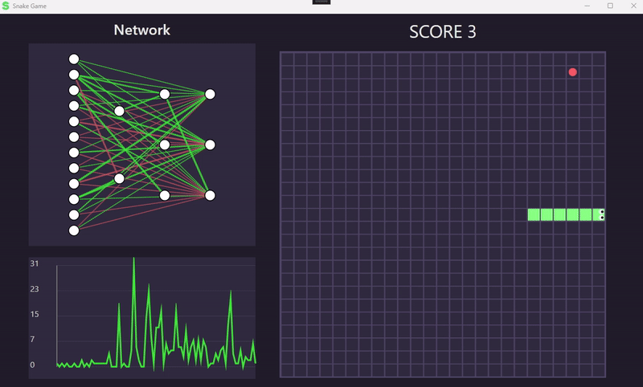

# SnakeAI-with-GNN-and-NEAT

This project was developed to test out my [NEAT](https://github.com/AshanHW/neat_gnn) C# library class.  
The game was developed by following [`OttoBotCode`](https://youtu.be/uzAXxFBbVoE?si=fXyPPFe_-gG9J1jx) YouTube channel.  
Credits to the OttoBotCode for the amazing tutorial and assets.

## Preview

## Controls
Press
* `T` - To train the network
* `I` - To run the best network from trainings
* `Any other key` - To play the game (Controllable via Arrow keys)

## Network Details

Each Genome has `11 input nodes` providing information on its head position, food direction and neighbour positions, then outputs 3 actions; `Forward, Right, Left`.  
All nodes aside output nodes have linear activation while ouput nodes are set with sigmoid activation.  
Other parameters for network can be configured via the `Config\config.json` file.

### Parameters
<ul>
  <li><b>Rows, Cols</b> : Size of the grid</li>
  <li><b>MaxStepsPerFood</b> : Step limit to prevent the AI from entering infinite loops</li>
  <li><b>Generations</b> : Number of generations to train</li> <li><b>PopulationSize</b> : Number of genomes (agents) per generation</li>
  <li><b>CompatibilityThreshold</b> : Threshold used to separate species in NEAT</li>
  <li><b>VisualSpeed</b> : Delay of the AI inference visualization (lower is faster)</li>
  <li><b>FoodReward</b> : Fitness reward for reaching food</li>
  <li><b>DistanceReward</b> : Fitness reward for moving closer to food</li>
  <li><b>DeathPenalty</b> : Fitness penalty applied when the agent dies</li>
  <li><b>EfficiencyBonus</b> : Bonus for reaching food in fewer steps</li>
  <li><b>C1</b> : NEAT compatibility coefficient for excess genes</li>
  <li><b>C2</b> : NEAT compatibility coefficient for disjoint genes</li>
  <li><b>C3</b> : NEAT compatibility coefficient for weight differences</li>
  <li><b>WeightMutationRate</b> : Probability of mutating connection weights</li>
  <li><b>AddConnectionRate</b> : Probability of adding a new connection</li>
  <li><b>AddNodeRate</b> : Probability of adding a new node</li> </ul>
